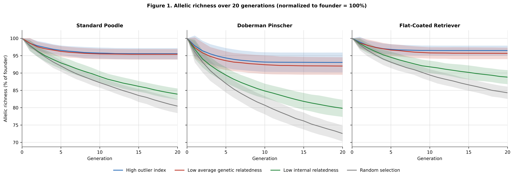
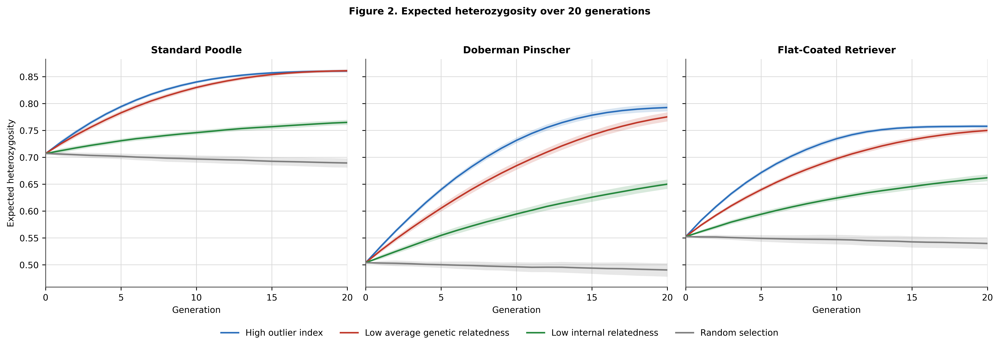
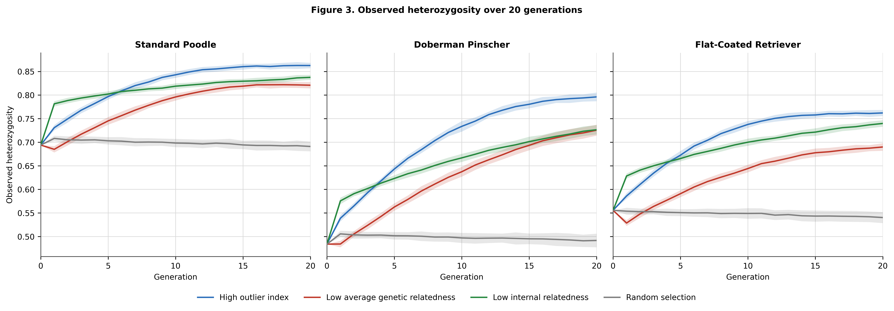
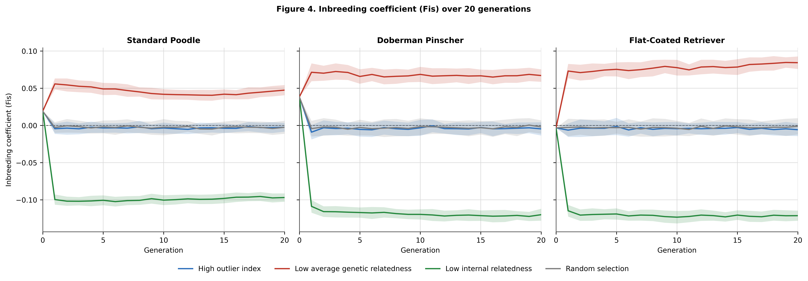
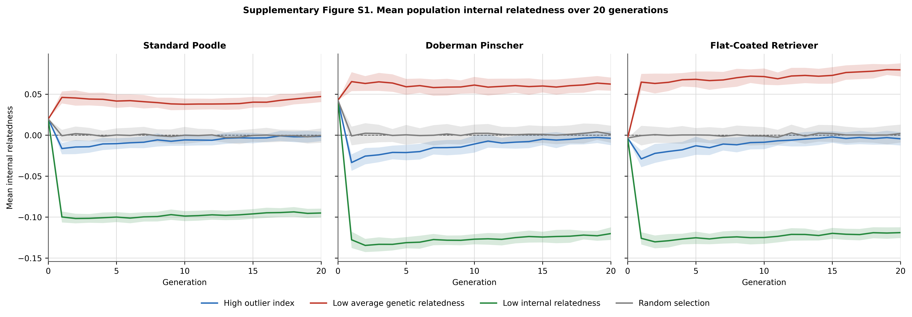
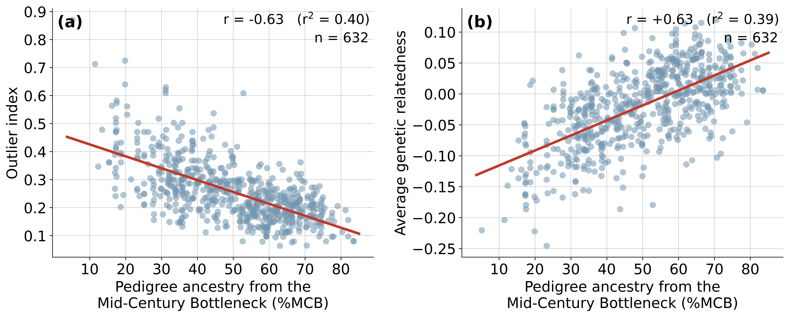

**Selecting puppies for underrepresented alleles conserves genetic diversity: a forward simulation in three dog breeds**

*Natalie Green Tessier*

Running title: Selecting puppies to conserve diversity

**Abstract**

Genetic bottlenecks in purebred dog breeds, *Canis lupus familiaris*, leave a large proportion of all allelic variation at low frequencies and at risk of loss. Inbreeding avoidance, the historical method of maintaining variation, can slow but not stop that loss. Genetic data now allows direct selection of breeding stock best able to preserve original allelic variation. In a forward simulation, we tested selection strategies in three bottlenecked breeds with different population structure. Two strategies chose puppies with more underrepresented alleles (high outlier index and low average genetic relatedness), and we compared these with selecting the least inbred puppies, and with random selection. Founder populations of 200 real dogs, genotyped at 33 microsatellite loci, were bred forward for 20 generations, 50 replicates per breed, with equalized family sizes and randomized mates. Selecting unusual puppies arrested allele loss in roughly ten generations. Expected heterozygosity in Dobermans rose from 0.50 to 0.79 with high outlier index selection and to 0.78 with low average genetic relatedness selection. High outlier index selection kept inbreeding at or near zero without selecting against it; low average genetic relatedness selection raised it moderately. Selecting the least inbred puppies lowered inbreeding most but preserved markedly less allelic variation, losing three times as many alleles as outlier index selection. All three strategies outperformed random selection. Population structure and existing allelic variation affected outcomes. We recommend selection of breeding stock with more underrepresented alleles to prevent loss of original allelic variation while controlling inbreeding in purebred dogs.

**Keywords:** allelic variation, heterozygosity, bottleneck, inbreeding, purebred dogs, conservation genetics

**Introduction**

Many, though not all, purebred dog breeds have experienced a genetic bottleneck due to historical events, traditional breeding practices, and popular sire syndrome. This is evident from their high average inbreeding and depleted allelic richness (Leroy, 2011; Marsden et al., 2016; Willi et al., 2022). Most scientific literature focuses on inbreeding as the cause of health problems in purebred dogs (Bannasch et al., 2021). Limiting inbreeding, therefore, is the correct response. Active preservation of original allelic variation, however, is equally important because that variation determines how much heterozygosity is possible in a breed. It gets little focus in the literature and in breeding communities. This leaves a gap in breeders' conservation efforts since they have no central breeding management. While conscientious breeders can keep inbreeding levels relatively low or stable, distinct alleles continue to be lost to drift. Without monitoring allelic variation, we cannot understand the rate of loss or how to prevent it.

"Genetic diversity" is an overarching term that is sometimes used to mean heterozygosity (when alleles at a locus are not identical) and sometimes used to mean allelic variation (how many distinct alleles are found at any given locus). Heterozygosity and allelic variation are two different axes that, combined, determine how genetically diverse a breed is. Each axis has a matching instrument of measurement. Large panels of single nucleotide polymorphisms read "same or different" at many thousands of sites, giving detailed estimates of inbreeding and runs of homozygosity. Panels of well-validated multi-allelic loci read "common or uncommon" through allele count and allele frequencies (Allendorf et al., 2024). These two instruments do different, necessary tasks well. Neither is expendable.

Heterozygosity in a population is necessary for short-term adaptive capacity. It lowers the frequency of expression of deleterious recessives (Sams & Boyko, 2019), and is associated with better immune function (Brambilla et al., 2018) and higher fertility (Chu et al., 2019). It is also the natural result of ample allelic richness at relatively balanced frequencies. That allelic richness, while not in and of itself protective (Teixeira & Huber, 2021; but see Kardos et al., 2021), is the raw genetic material necessary for long-term adaptive capacity in any population, variation used to survive new biological threats and changing climates (Caballero & García-Dorado, 2013; Allendorf et al., 2024).

Genetic bottlenecks, by definition, lower the frequencies of underrepresented founders' alleles without regard to their effect, and by sheer volume, most of those are ordinary, benign variation. We cannot abandon the likely majority of benign allelic variation due to the likely minority of deleterious alleles, but we must have some filter. Raising the frequencies of all underrepresented alleles, while still selecting and screening for robust good health, is a direct way to separate the benign from the deleterious, and mirrors natural selection to some extent. Allelic variation at accessible frequencies may offer the ability to mitigate bottleneck effects and to breed away from the extreme dysfunctional morphology found in some breeds. When genes for functional phenotype are gone from a breed, there is no other option than to outcross to another breed. While existing allelic variation needs conservation, any outcross programs that bring in new variation also need more than inbreeding avoidance to raise the frequencies of any new variation high enough to have a beneficial effect on a breed.

Pedersen et al. (2015) found a pronounced imbalance in Standard Poodles, with 70% of the breed's genetic diversity residing in only 30% of the dogs. Those genetic outliers owe their ancestry to bloodlines largely outside the popular ones whose multi-generational inbreeding produced that breed's bottleneck. To conserve underrepresented ancestry, we must identify the genetic outliers that carry a larger proportion of lower-frequency alleles. We can estimate this from complete, accurate pedigrees of 15 generations or more, or we can use multi-allelic marker panels. Genetic data, properly assessed and interpreted, is far easier and actionable.

Until relatively recently, pedigrees of five generations or fewer were how breeders determined inbreeding in potential litters. Mathematical pedigree-based calculations are only as good as the pedigrees are deep, complete and accurate. Genetic and genomic data have proven more accurate and reliable, but focus has remained on mate selection and mate relatedness because these were the traditional levers to adjust population structure. Pairwise relatedness values are also inherently measures of heterozygosity (same or different) and not of allelic variation (common or uncommon). Pedigree-based calculations also cannot determine the range of diversity in full siblings, even though siblings vary. Genetic data can. Puppy selection for conservation offers more power to change the breed than mate selection does, since it can stack the deck in favor of variation by ensuring there's more allelic richness conserved in each successive generation. Fernández et al. (2004) reached this same conclusion via simulation.

Conserving allelic richness requires a method of separating the two dynamics. Heterozygosity depends on how genetically similar two mates are. Allelic variation conservation depends on how genetically similar two mates are to the rest of the breed. Common dogs can be inbred or outbred. Unusual dogs can be either as well. Increasing heterozygosity can be done in a single generation, if necessary. Conserving underrepresented genetics requires consistent widespread application of effort. One is an individual consideration. The other is a population consideration.

We use two measures to find the puppies most valuable to conservation --- dogs with the most underrepresented ancestry. The first is average genetic relatedness (AGR), a molecular analog of mean kinship as described by Ballou and Lacy (1995), who used mean pedigree-based relatedness. Like mean kinship, it comes from deriving the pairwise genetic relatedness between a dog and every other dog in the breed, and averaging them. A low AGR identifies a dog likely to have a higher proportion of underrepresented alleles, and a high AGR identifies a dog likely to have a higher proportion of high-frequency alleles.

The second measure is the outlier index (OI), which quantifies the proportions of low-, mid- and high-frequency alleles found in one dog to estimate how unusual that dog is likely to be. A high OI identifies dogs with a higher proportion of mid- and low-frequency alleles and a low OI identifies dogs with more high-frequency alleles.

Sams et al. (2020) tested pairwise mate selection using a simulated small panel of polymorphic loci and described their study as "a first step". Our simulation used genotypes from real dogs for our founder populations, tested with a commercially available panel of carefully selected and validated polymorphic loci. We tested population-level metrics on "keeper" puppies with more underrepresented alleles rather than selecting on genetic distance between two dogs. Small panels are not optimal for maximizing heterozygosity --- but they are excellent for identifying unusual individuals.

We performed this forward simulation using these limited founder populations to test whether selecting for underrepresented alleles better preserves both short-term and long-term adaptive capacity in a breed than selecting against inbreeding or selecting randomly. We did not know the long-term outcomes of selection strategy, or how much power these various metrics might have. We hoped to see clear differences that could help breeders and benefit the breeds that most need management. We expected that selecting for underrepresented alleles consistently would preserve more allelic richness. We did not know the extent to which it could also lower or control inbreeding without ever selecting against inbreeding.

**Methods**

We tested "keeper" puppy selection rather than mate selection, because it is more consistently within a breeder's control.

Every dog was bred exactly once and every pair contributed two keepers to the next generation, so family size was held equal across the breeding population. This was deliberate as it made it possible to isolate the effects of each strategy used. Equalizing the number of offspring each dog contributes keeps any single dog from being more influential in a generation. It also slows the loss of diversity (Wang et al., 2016). It is also achievable as a cooperative project among diversity-minded breeders. It would require 50 breeders to own 4 dogs, bred once each for this project.

We did not include mutation in the simulation. Over 20 generations, the mutation rate at microsatellite loci is too low to count on for replacing lost alleles, and building it in would imply a potential benefit more probable than it is.

**The simulation**

We used a custom built, Python-based forward simulation application that uses real genotypes from dogs tested with the UC Davis Veterinary Genetics Laboratory (VGL) canine genetic diversity panel described below. That panel is available commercially and uses 33 microsatellite loci. Our simulation design has the same architecture as software such as VORTEX (Lacy, 1993; Lacy & Pollak, 2014) and simuPOP (Peng & Kimmel, 2005). It differs from those tools in that our founders are drawn from real microsatellite genotypes rather than simulated, and we test keeper-selection at each generation rather than mate selection.

Each replicate started with a new founder population with 100 males and 100 females with complete genotypes, randomly selected from a larger pool of the breed born after 1 January 2016. Because each founder population came from the same pool, some founders were in more than one replicate, but no founding generation was precisely the same 200 dogs.

We calculated allele frequencies, distinct alleles, average alleles per locus, expected and observed heterozygosity, effective alleles per locus, inbreeding coefficient and mean internal relatedness (IR) of the founding population and every generation's parent pool thereafter. We also tracked the percentages of low-frequency, mid-frequency and high-frequency alleles per generation to assess the rebalancing of allele frequencies. The thresholds for these were the same locus-specific thresholds used in the OI formula described below.

Mates were paired randomly, one male to one female, and then each parent pair "produced" a litter of ten "puppies" using a Mendelian method of randomly selecting an allele from each parent at each locus and assembling ten new genotypes. Each puppy genotype was analyzed to determine its AGR, OI and IR values. These ten puppy genotypes were then split randomly into two groups of five to simulate sexes. One puppy from each group was then selected based on the strategy being tested: lowest AGR, highest OI, lowest IR, or randomly. One puppy was then randomly assigned a sex and the other was assigned the opposite sex, and the two were added to the parent pool for the next generation.

We ran each simulation for 20 generations after the founding generation, 50 times per breed, in 3 breeds with different population structure. Data from these replicates are available with the supplementary material.

**The selection strategies**

The algorithms for each strategy are as follows:

The OI is computed per individual "puppy" using the parent generation's allele frequencies. For each locus, with a distinct allele count of N in the parent generation, an allele is classified as low-frequency if it falls below 0.75/N, high-frequency if above 1.25/N, and mid-frequency if between these bounds. These thresholds are locus-specific rather than fixed, normalizing for variation in allelic richness across loci. These high and low thresholds are applied identically in each breed in this simulation. The OI is then calculated as:

OI = (Lf / Hf) + (Mf / 2L)

where Lf is the count of the individual's alleles classified as low-frequency, Hf is the count classified as high-frequency, Mf is the count classified as mid-frequency, and L is the total number of loci (33). The first term weights the ratio of all of a dog's low-frequency to all of their high-frequency alleles; the second adds the percentage of their mid-frequency allele representation as a proportion of the individual's total allele slots. If Hf = 0, the Lf/Hf term is set to 0. The OI is recalculated each generation against the parent generation's allele frequencies.

This index is heuristic rather than derived from a population-genetic model. It is a simple way to identify dogs with more unusual ancestry, since individual heterozygosity and inbreeding coefficients cannot "read" whether ancestry is unusual for a breed or not. The second term softens selection that could unduly favor all low-frequency alleles and penalize all higher-frequency alleles. A higher OI value identifies genetic outliers. Comparison of OI values of individuals can only be made to others in the same population.

In a separate, 20-replicate simulation in all three breeds, we tested four other threshold windows, both tighter and broader, and compared to the window in this simulation, 0.75/N to 1.25/N. This was to assess threshold sensitivity. They were: 0.90/N to 1.10/N, 0.825/N to 1.175/N, 0.675/N to 1.325/N, and 0.60/N to 1.40/N (Supplementary Table S6).

AGR is the molecular analog to mean kinship as described by Ballou and Lacy (1995), who used pedigree-based calculation. In any population, it is a single number derived from obtaining the numerical pairwise genetic relatedness value between each individual and every other individual in the population and averaging them. In this simulation, the AGR of each individual "puppy" is the mean of the pairwise genetic relatedness values between that puppy and every dog in the parent generation, using the Wang (2002) pairwise estimator and the parent generation's allele frequencies. Lower AGR indicates an individual less related, on average, to the parent population. Averaging these pairwise values into a population-based metric is far more reliable and diminishes the noise found in any single pairwise genetic relatedness value. AGR calculated this way is also very effective at identifying ancestry from a population standpoint (Supplementary Figure S2b) without any reference to pedigrees. AGR is typically slightly higher or lower than zero. It is also dependent on the allele frequencies of each breed and generation.

IR is an inbreeding measure computed per individual following Amos et al. (2001): a frequency-weighted measure of homozygosity across the 33 loci, in which homozygosity for lower-frequency alleles is weighted more heavily. Lower IR indicates a less inbred individual.

Random selection is the control: the same procedure with no metric applied, one puppy drawn at random from each group of five.

**The three breeds**

We used Standard Poodles, Dobermans, and Flat-Coated Retrievers for this simulation because they all have pronounced bottlenecks and different population structure. The Standard Poodle maintains a few distinct lines but carries a documented imbalance, with most of its diversity concentrated in a small minority of dogs (Pedersen et al., 2015). The Doberman is a populous breed worldwide with both European lines (show and work) and American lines (show and pet), nearly all with the same bottleneck signature, meaning the lines are distinguishable but still closely related (Wade et al., 2023). Finally, the Flat-Coated Retriever is relatively low in allelic variation in dogs born since 2016 and may represent a population post-bottleneck. Breed-wide VGL statistics for the three breeds are summarized in Supplementary Table S8 (accessed August 20, 2026). The gap between average and effective alleles per locus in each breed runs from 58% to 71%, which suggests a genetic bottleneck signature in each.

We took samples from an eligible pool of 3,765 Standard Poodles, 862 Dobermans, and 436 Flat-Coated Retrievers from the BetterBred database. These are subsets of totals in that database and the VGL database, which are separate. All dogs were born after 1 January 2016, and 3,540, 859, and 436 distinct dogs, respectively, were drawn as founders across the 50 replicates. Founder-pool expected heterozygosity matched the breed-wide VGL values within about 0.01 in every breed. All breeds are biologically capable of 10-puppy litters, and all breeder communities have some diversity-minded breeders aware of the dangers of popular sires, making the family size restriction in the simulation design plausible.

**The genotyping**

Panel composition follows Pedersen et al. (2015); genotyping and primer pairs are as described in Pedersen et al. (2012) and Wictum et al. (2013). Data were submitted by owners with permission to use for research since 2016.

The 33 loci map to 25 canine autosomes. Loci used were developed and validated for independent segregation, as required for the product rule in parentage and identity testing. In Wictum et al.'s (2013) validation in 25 breeds, gametic disequilibrium was detected in 9.1% of within-breed locus pairs, but there was no consistent pattern in pairs or breeds. This disequilibrium had a random distribution, indicating that it was due to population inbreeding rather than physical linkage. We mapped all 33 loci to canFam4 by in-silico PCR of the published primer pairs (Supplementary Table S7). The closest two loci are 6.75 Mb apart, beyond the distances at which D′ falls to 0.5 within dog breeds (0.4--3.2 Mb; Sutter et al., 2004). We therefore treat the loci as independent, as required by the OI, IR, and AGR. The remaining seven loci of the 40-locus VGL diversity panel lie in the dog leukocyte antigen (DLA) class I and II regions, are inherited as extended haplotypes, and were excluded.

**Statistical analysis**

Because effective alleles (1/(1 − He,locus), averaged across the 33 loci) are calculated directly from expected heterozygosity, we report them only as a descriptor of expected heterozygosity and not as independent confirmation, a distinction also drawn by Allendorf et al. (2024). Observed heterozygosity, by contrast, is a direct count of heterozygous genotypes rather than a function of expected heterozygosity, and is treated here as an independent outcome. We do not report effective population size. The heterozygosity-decay estimator requires heterozygosity to be falling, and it falls only under random selection. OI, AGR, and IR selection raise heterozygosity, resulting in negative values and making the estimator uninformative.

We interpret results primarily by effect sizes and replicate-level consistency, with the paired tests reported as supporting detail. We used two-sided Wilcoxon signed-rank tests to compare average alleles per locus, expected heterozygosity, effective alleles per locus, mean population IR, and observed heterozygosity at generation 20 between each strategy pair within each breed. Because all strategies and random selection used the same founder draw per replicate, comparisons were paired by replicate, which removes founder-draw variance from the contrast. Breed pools were finite, so some founder population draws had some dogs in common and therefore replicates within a breed are not fully independent. This is most so in the Flat-Coated Retriever, where each draw of 200 came from a pool of 436.

The within-replicate pairing and the size and consistency of the differences across all 50 replicates, however, make this non-independence immaterial to the conclusions. P-values were Bonferroni-corrected for 18 simultaneous comparisons (6 pairs × 3 breeds) within each outcome variable. All tests were run in Python 3 using scipy.stats.wilcoxon. Full pairwise results for all five outcome variables are provided in Supplementary Tables S1--S5. The only effect sizes reported in the text (OI versus AGR on expected heterozygosity) are Cohen's d\_z, the mean within-replicate difference divided by its standard deviation, consistent with the paired design.

**Results**

**Allelic richness preservation**

Selection for high OI and low AGR substantially outperformed low IR and random selection at preservation of allelic variation in all three breeds (Table 1; Table S1). For conservation of distinct alleles, selection for high OI retained numerically more alleles per locus than selection for low AGR in every breed, but only one margin is statistically reliable. The Doberman margin was the largest (0.06) but varied widely from replicate to replicate and is not statistically distinguishable after correction (Table S1). The Flat-Coated Retriever margin was smaller (0.04) but nearly uniform across replicates, and holds after correction. In the Standard Poodle, the two strategies did not differ. Selection for low IR outperformed random selection on preservation of alleles (Figure 1; Table 1; Table S1).

Both high OI and low AGR selection strategies slowed allele loss until it essentially arrested within the simulation window (Figure 1): across the final five generations, the mean total allele count (summed across all 33 loci) changed by 0.12 of an allele or less in every breed. This is a per-generation slope indistinguishable from zero. In contrast, both low IR and random selection continued to shed between roughly 0.5 and 1.7 alleles per generation, with no sign of leveling (Table 2). With high OI and low AGR selection, allele loss did not just slow --- it stopped. Mean allele count reached a plateau (meaning 95% of eventual loss was complete) by roughly generation 10 in every breed under both strategies. Counts then held steady to generation 20 (Figure 1; Table 2). With low IR and random selection it kept falling.

Random selection lost the most allelic richness in all breeds (Figure 1; Table 1; Table S1).

*Figure 1. Allelic richness over 20 generations by selection strategy, normalized to starting allelic richness (= 100%). Lines are means of 50 replicates; shaded bands are ±1 SD. With high outlier index and low average genetic relatedness selection, loss arrests within the simulation window. With low internal relatedness and random selection, loss continues through generation 20.*

Alt text: Three line charts, one per breed, showing allelic richness per generation as a percentage of starting richness. With selection for high outlier index and low average genetic relatedness, loss slows immediately and is arrested by roughly generation 10 in each breed. With selection for low internal relatedness and random selection, the curves continue to decline to generation 20, with random selection lowest in all three breeds.

**Table 1. Founder (generation 0) and generation-20 diversity metrics by strategy in each breed.**

  -------------- --------- -------- -------- -------- ----------- -------- -------- ---------
  **Strategy**   **Gen**   **Na**   **He**   **Ho**   **Na\_e**   **OI**   **IR**   **Fis**
  ***SP***                                                                          
  Founder        0         8.38     0.707    0.694    3.81        0.30     0.020    0.019
  High OI        20        8.00     0.861    0.863    7.81        1.92     −0.001   −0.003
  Low AGR        20        7.99     0.861    0.821    7.87        1.64     0.047    0.047
  Low IR         20        7.03     0.765    0.838    4.56        0.43     −0.095   −0.097
  Random         20        6.74     0.689    0.691    3.61        0.38     −0.001   −0.002
  ***DP***                                                                          
  Founder        0         5.97     0.504    0.484    2.32        0.23     0.043    0.038
  High OI        20        5.56     0.793    0.796    5.41        1.86     −0.004   −0.005
  Low AGR        20        5.50     0.775    0.726    5.17        1.18     0.062    0.067
  Low IR         20        4.77     0.650    0.727    3.09        0.43     −0.120   −0.120
  Random         20        4.33     0.490    0.492    2.25        0.32     0.001    −0.002
  ***FCR***                                                                         
  Founder        0         5.05     0.553    0.556    2.55        0.38     −0.003   −0.003
  High OI        20        4.88     0.758    0.762    4.78        1.97     −0.004   −0.006
  Low AGR        20        4.83     0.750    0.690    4.70        1.56     0.080    0.084
  Low IR         20        4.49     0.662    0.740    3.25        0.57     −0.119   −0.121
  Random         20        4.26     0.540    0.540    2.49        0.43     0.002    −0.001
  -------------- --------- -------- -------- -------- ----------- -------- -------- ---------

*Means of 50 replicates. The Founder row is the generation-0 starting population (shared across strategies); the four strategy rows are generation-20 values. Breeds: SP, Standard Poodle; DP, Doberman Pinscher; FCR, Flat-Coated Retriever. Columns: Na, mean alleles per locus; He, expected heterozygosity; Ho, observed heterozygosity; Na\_e, effective alleles; OI, outlier index; IR, internal relatedness; Fis, inbreeding coefficient. Na, Na\_e, and OI to two decimals; He, Ho, and IR to three (the High OI versus Low AGR margin in He, and the sign of IR near zero, are both lost at two). Replicate standard deviations were small across all strategies and breeds (n = 50): Na 0.07--0.17, He 0.002--0.013, Ho 0.005--0.014, Na\_e 0.06--0.15, IR 0.005--0.011, and OI 0.03--0.40; per-cell values are available on request. Strategies: High OI, selecting puppies with the highest outlier index; Low AGR, the lowest average genetic relatedness to the breed; Low IR, the lowest internal relatedness; Random, random selection.*

**Table 2. Allele loss over the final five generations (generation 15 → 20), mean total alleles across all 33 loci.**

  ----------------------- -------------- ------------------ ------------ -------------------------
  **Breed**               **Strategy**   **Alleles lost**   **% lost**   **Slope (alleles/gen)**
  Standard Poodle         High OI        0.04               0.02%        −0.008
                          Low AGR        0.00               0.00%        0.000
                          Low IR         6.24               2.62%        −1.270
                          Random         8.46               3.66%        −1.732
  Doberman Pinscher       High OI        0.06               0.03%        −0.013
                          Low AGR        0.12               0.07%        −0.025
                          Low IR         3.94               2.44%        −0.791
                          Random         7.18               4.78%        −1.399
  Flat-Coated Retriever   High OI        0.00               0.00%        0.000
                          Low AGR        0.06               0.04%        −0.012
                          Low IR         2.28               1.52%        −0.458
                          Random         3.80               2.63%        −0.775
  ----------------------- -------------- ------------------ ------------ -------------------------

*Means of 50 replicates. "Alleles lost" is the decline in total distinct alleles from generation 15 to 20; "% lost" is that decline as a percentage of the generation-15 count; slope is the linear fit over generations 15--20. Generation-0 founder totals (mean of the per-replicate founding counts across the 50 replicates): Standard Poodle \~277, Doberman \~197, Flat-Coated Retriever \~167. Strategies: High OI, selecting puppies with the highest outlier index; Low AGR, the lowest average genetic relatedness to the breed; Low IR, the lowest internal relatedness; Random, random selection.*

**Allele frequency band composition**

We tracked the percentage of distinct alleles in low-, mid-, and high-frequency categories in each generation to see how they changed. In the founder populations (generation 0), most distinct alleles fell in the low-frequency band in all three breeds: 59.1% in the Standard Poodle, 62.3% in the Doberman, and 54.8% in the Flat-Coated Retriever. The high-frequency band was the next largest (roughly 28--31%) and the mid-frequency band the smallest (Table 3). With selection for high OI and low AGR, distribution shifted toward the middle: low- and high-frequency alleles were both drawn into the mid-frequency band. By generation 20, the mid-frequency bands were between 76.9% and 95.6% of alleles, while the high-frequency band fell to 10.9% or less. In every breed a small share of high-frequency alleles remained. With selection for low IR and random selection, the low-frequency band remained largest at 38.9% to 55.8%, and high-frequency alleles accounted for 30% to 36%, even as total allelic richness declined.

**Table 3. Allele frequency band composition (% of distinct alleles), generation 0 versus generation 20 by strategy.**

  ------------------------- --------------------- ----------------------- --------------------------- --------- --------- ---------- --------- --------- ----------
                            **Standard Poodle**   **Doberman Pinscher**   **Flat-Coated Retriever**                                                      
  **Generation/Strategy**   **Low**               **Mid**                 **High**                    **Low**   **Mid**   **High**   **Low**   **Mid**   **High**
  Gen 0/Founders            59.1                  9.7                     31.1                        62.3      10.0      27.8       54.8      17.1      28.0
  Gen 20/High OI            4.9                   89.5                    5.7                         4.7       90.6      4.7        2.9       93.7      3.4
  Gen 20/Low AGR            2.3                   95.6                    2.1                         12.2      76.9      10.9       5.3       89.8      4.8
  Gen 20/Low IR             45.7                  19.2                    35.1                        44.9      19.4      35.6       38.9      28.5      32.6
  Gen 20/Random             53.9                  15.3                    30.8                        55.8      13.1      31.2       51.4      18.3      30.4
  ------------------------- --------------------- ----------------------- --------------------------- --------- --------- ---------- --------- --------- ----------

*Means of 50 replicates. The Gen 0/Founders row is the founding population itself --- the distinct-allele band composition of each replicate's 200 founders, reconstructed from their genotypes and averaged across the 50 replicate draws (replicate SD 0.8 to 1.6 percentage points). The four Gen 20 rows are generation 20 under each selection strategy: High OI, selecting puppies with the highest outlier index; Low AGR, the lowest average genetic relatedness to the breed; Low IR, the lowest internal relatedness; Random, random selection.*

**Threshold sensitivity**

Tightening the classification window (see Methods) slightly increased the selection pressure driving frequencies toward the mean, and results over 20 generations shifted only negligibly. Loosening it relaxed that pressure, and at the widest window effective alleles fell slightly in every breed (Supplementary Table S6). This suggests that windows must be tight enough to provide sufficient selection pressure.

**Homozygosity**

Both high OI and low AGR selection substantially improved expected heterozygosity and its corollary, effective alleles (Figure 2; Table 1; Tables S2--S3). In the Standard Poodle, expected heterozygosity results from both strategies were essentially equal, and AGR was higher on effective alleles by 0.06, 7.87 against 7.81 (Bonferroni-corrected p = 0.038; Table S3). In the Doberman and the Flat-Coated Retriever, OI selection produced higher results on both measures (Tables S2--S3). The expected heterozygosity margins were 0.017 in the Doberman and 0.008 in the Flat-Coated Retriever (Cohen's *d\_z* ≈ 2.1 and 1.4), with OI ahead in 50 of 50 replicates in the Doberman and 46 of 50 in the Flat-Coated Retriever; in the Standard Poodle the margin was 0.000, with AGR fractionally ahead.

Observed heterozygosity showed a partly different ordering (Figure 3; Table S5). OI produced the highest observed heterozygosity in every breed, significantly above every other strategy, and all three selective strategies raised it well above random selection. Selection for IR held observed heterozygosity as high as or higher than selection for AGR, even though AGR selection far exceeded IR selection on expected heterozygosity and allele count. OI was the only strategy to lead or tie for the lead on allele preservation, expected heterozygosity, and observed heterozygosity at once.

At generation 20, the gap between expected and observed heterozygosity, standardized as the population inbreeding coefficient (Fis), separated the three: high OI selection held them equal, low AGR selection ran an observed-heterozygote deficit (Fis roughly 0.05 to 0.08), and low IR selection an excess (Fis roughly −0.10 to −0.12). Both high OI and random selection held Fis at Hardy--Weinberg expectation (Figure 4). Mean IR matched Fis almost exactly (r ≈ 1.00; Figure 4, Figure S1); selecting for low IR is, in this population, selecting for a low inbreeding coefficient.

*Figure 2. Expected heterozygosity over 20 generations by selection strategy. Lines are means of 50 replicates; shaded bands are ±1 SD; shared y-axis across breeds for visual comparability. High outlier index and low average genetic relatedness selection produce substantial expected heterozygosity gains in all three breeds; low internal relatedness selection raises it modestly; with random selection, it declines slightly.*

Alt text: Three line charts of expected heterozygosity over 20 generations. Selection for high outlier index and low average genetic relatedness raises expected heterozygosity steadily in all breeds, most sharply in the Doberman, from about 0.50 at the start to 0.79 and 0.78 by generation 20. Selection for low internal relatedness produces smaller gains and random selection remains near its starting value.

*Figure 3. Observed heterozygosity over 20 generations by selection strategy. Lines are means of 50 replicates; shaded bands are ±1 SD; shared y-axis across breeds. High outlier index selection produces the highest observed heterozygosity in all three breeds; low internal relatedness selection holds observed heterozygosity high despite lower expected heterozygosity; low average genetic relatedness selection runs an observed-heterozygote deficit; random selection remains near founder levels.*

Alt text: Three line charts of observed heterozygosity over 20 generations. With selection for high outlier index, observed heterozygosity closely tracks expected heterozygosity in every breed. With selection for low average genetic relatedness, it runs below expected values, and with selection for low internal relatedness, it runs above them. Random selection tracks its lower expected heterozygosity values closely.

*Figure 4. Inbreeding coefficient (Fis) over 20 generations by selection strategy. Lines are means of 50 replicates; shaded bands are ±1 SD; the 0 reference line marks Hardy--Weinberg expectation. Low average genetic relatedness selection drives Fis positive (a genome-wide heterozygote deficit) in all three breeds; low internal relatedness selection drives it well below zero (heterozygote excess); high outlier index and random selection hold Fis near zero.*

Alt text: Three line charts of the inbreeding coefficient Fis over 20 generations. Selection for high outlier index holds Fis at or near zero in all breeds without any selection against inbreeding. Selection for low average genetic relatedness runs a positive Fis of roughly 0.05 to 0.08 steadily through 20 generations, selection for low internal relatedness a negative Fis of roughly −0.10 to −0.12, and random selection stays near zero.

**Discussion**

**Background**

Over the last decade, there has been growing awareness in dog breeding communities, clubs and registries that loss of genetic diversity in purebred dogs must be addressed (Proschowsky et al., 2025). Much scientific literature has been dedicated to assessing inbreeding and its effects on breeds. Tools for breeders to make breeding decisions have expanded from large pedigree databases to microsatellites to smaller and larger single nucleotide polymorphism chips. Calls to re-open breed registries have increased and some kennel clubs have developed crossbreeding programs for depleted breeds in order to increase genetic variation and lower disease frequency (Stronen et al., 2017). Nearly all available tools, projects, and education target inbreeding, its consequences and its avoidance.

For at least forty years, conservation geneticists have known of another equally important target of preservation: allelic variation (Allendorf, 1986). In populations with reasonably balanced allele frequencies, inbreeding avoidance is effective at conserving allelic variation (Fernández et al., 2004). When frequencies are skewed from a genetic bottleneck, however, the alleles most at risk of loss contribute the least to heterozygosity (Allendorf et al., 2024). Modern methods used to minimize coancestry were developed to maximize heterozygosity; they preserve allelic variation only indirectly (Fernández et al., 2004; Gómez-Romano et al., 2013). Maximizing heterozygosity will often pair a mate with common ancestry to a mate with unusual ancestry, resulting in offspring likely to inherit half as much unusual ancestry as their unusual parent. Thus, the more severe a bottleneck, the more quickly the loss of low-frequency alleles.

Most low-frequency alleles in bottlenecked breeds are low due to the events that caused some families to be common and others far less so. Those less-influential families' genetic contributions are therefore crucial to preserve, as they represent alleles found in the original breed, despite the families being obscure or less popular. Closed breeds are both beloved for their predictable traits and consistently losing their underrepresented alleles, losses they cannot afford. Preserving desired traits by prioritizing only them and preserving broad genetic diversity are therefore invisibly in competition.

In a parallel dynamic, reestablishing gene flow through crossbreeding will add allelic richness, but will also lose breed traits. Crossing back to the original breed can bring back breed traits, but will also lose both the new and existing variation (Windig & Doekes, 2018). Being able to select for observable traits while selecting for unusual alleles at neutral loci is an appropriate antidote for these dilemmas.

Inbreeding may have helped get breeds into these depleted states, but outbreeding cannot get them out. Maintaining allelic variation at intermediate frequencies, whether original or introgressive, can (Fernández et al., 2004). Allendorf et al. (2024), and more recently Hoban et al. (2026), identified a gap in practical guidelines for conservation and monitoring of allelic diversity: there really are none. This simulation offers methodology that allows for monitoring and management of allelic variation in closed gene pools. It also suggests that there is a point at which limited existing variation, even well managed, may not be sustainable, as in the Flat-Coated Retriever, where allele counts plateaued but inbreeding continued a slight rise in later generations. There is no allelic variation equivalent of heterozygosity's 50/500 rule, and one breed's results cannot establish a guideline. Hoban et al. (2026) call for simulations that offer alarm thresholds for loss, and this breed's results suggest one can be developed. More research should be done with real genotypes from different breeds.

**What we found**

In every breed this simulation tested, selecting puppies based on their potential contribution to balancing allele frequencies rather than on their inbreeding estimate preserved more total alleles and effectively stopped their loss by roughly ten generations.

AGR selection is the method closest to the conservation gold standard of selecting for mean kinship. It preserved allele count and raised expected heterozygosity essentially as much as OI selection in the Standard Poodle and nearly as much in the Doberman and Flat-Coated Retriever. However, it increased inbreeding and IR in all three breeds, with a continued slight climb in the Flat-Coated Retriever.

Typically in a bottlenecked breed, there is a single, identifiable, large, common family. The Wang genetic relatedness estimator used on this panel data does a good job of distinguishing dogs that are very related from dogs that are very unrelated (Supplementary Figure S2b). When all pairwise relatedness estimator values for a single dog are averaged, that number is effective at tracking how common or unusual a dog is in a breed. It is, however, specifically referential to the large common family that dominates in each of the breeds in the simulation. Homozygous low-frequency loci are, in essence, read by the Wang estimator as most unrelated to the norm, so it scores dogs with them as very distant in relatedness. By selecting for low AGR, the first generation's parent pool immediately had more unusual, homozygous dogs, so inbreeding metrics rose in all breeds and then stayed at roughly that heightened level.

By contrast, OI does not use relatedness to detect differentness, and it does not consider homozygosity at all. The two frequency-based metrics do usually select similar dogs, so both slow and arrest loss of alleles in roughly ten generations. Selection for high OI, however, kept inbreeding and mean IR near zero without ever selecting against them. Its construction is akin to the idea of variance from the ideal (Fernández et al., 2004): at a locus with ten alleles the "ideal" distribution is ten percent each. In real populations frequencies vary, and in bottlenecked populations they can vary a great deal. Given raw frequency data, breeders can be tempted to single out rare alleles to preserve, but selecting on any one allele or locus is risky, and can make a panel less useful, since loci are selected for panels precisely because they are not under selection. Some deleterious alleles will be rare due to specific selection against them, but the panel cannot distinguish which they are. OI was built to avoid specific selection on any one allele or locus. By grouping alleles by frequency category, the algorithm allows all low-frequency alleles to be brought up into a safe zone, and keeps all high-frequency alleles from dominating, all without selecting on one specific allele or locus. Selection pressure for health will also exist and can either keep deleterious recessives rare or, should they appear as homozygotes, DNA tests can be developed. This same selection pressure can filter deleterious additive alleles (arguably the more difficult target), at any frequency, while leaving benign and beneficial variation to balance.

The thresholds that control what defines mid-frequency are standardized here. Future research may find broader or tighter thresholds for mid-frequencies work best for different breeds or allele frequency profiles.

One consequence of the formula could surface only when frequencies become very balanced, and a dog inherits no high-frequency alleles. This is highly unlikely in a closed gene pool, since having alleles in common is part of what identifies a breed as itself. However, should it happen, then that dog's Lf/Hf term is set to 0. A dog with one low-frequency allele and one high-frequency allele will have an OI of 64/66 + 1/1, or 1.97, while a dog with two low-frequency alleles and no high-frequency alleles will have an OI of 64/66 + 0, or 0.97. At that point, the index rewards the dog still carrying a high-frequency allele. Retaining a high-frequency allele in a population that balanced is not detrimental.

Both OI and AGR were also tested against an independent data type from 632 Standard Poodles with known 15-generation pedigrees. The percentages of ancestry these dogs inherited from the Mid-Century Bottleneck (Pedersen et al., 2015), ten influential dogs born between 1948 and 1952, were tracked by both metrics equally well. Computed from the cohort's allele frequencies, OI fell as bottleneck ancestry rose (Pearson r = −0.63) and AGR rose with it (r = +0.63; Supplementary Figure S2). They therefore recover deep pedigree structure from genetic data alone.

In a breed that still holds allelic variation in different subpopulations, like the Standard Poodle, the dogs richest in less common alleles are usually also the least related to the breed's core, so OI and AGR are well correlated (−0.81). Where most dogs share the same common alleles, the agreement loosens (−0.66 in the Doberman, −0.67 in the Flat-Coated Retriever).

Selection for low IR preserved more allelic richness than random selection, but far less than either strategy above. It drove both the inbreeding coefficient and mean IR furthest below zero, and it held observed heterozygosity above expected heterozygosity by roughly 0.07 to 0.08 at generation 20. That reduction in inbreeding, however, came at the cost of allelic variation. Its heterozygote excess was caused by more heterozygous pairs of higher-frequency alleles, and progressively fewer lower-frequency alleles. Selecting against dogs with more low-frequency homozygous loci means uncommon alleles are only passed as part of a heterozygous pair, half as often as from a homozygous locus (Table 3).

IR uses allele frequency, but only to estimate inbreeding more accurately, not to identify common versus uncommon dogs. The best illustration of this came in 2015, with two highly inbred, registered Standard Poodles with nearly matching IR and very different pedigrees. A dog we will call Onyx descended almost entirely from the aforementioned Mid-Century Bottleneck (Pedersen et al., 2015) and carried nearly all high-frequency alleles. In contrast, Harriette, the product of an accidental full-sibling mating, descended from two very unusual, unrelated lines. Based on IR alone, neither would add to conservation efforts. Both OI and AGR, however, read Onyx as highly representative of the bottleneck line, and Harriette as extremely different from the bottleneck. Harriette had much variation to contribute, and her high homozygosity would ensure she passed many of those alleles on. Onyx, from a line known for conformation, had very little variation to offer the gene pool that wasn't already well represented. Both, if sound, healthy and of good temperament, could be bred, but their value to conservation would be vastly different.

**Table 4. Two highly inbred Standard Poodles: nearly matching internal relatedness, opposite outlier index.**

  ----------- ------------------- --------------------------------- -------------------------- ----------------------- -------------- --------------
  **Dog**     **Outlier index**   **Average genetic relatedness**   **Internal relatedness**   **High-freq alleles**   **Mid-freq**   **Low-freq**
  Onyx        0.02                0.06                              0.51                       65                      0              1
  Harriette   0.45                −0.22                             0.48                       43                      10             13
  ----------- ------------------- --------------------------------- -------------------------- ----------------------- -------------- --------------

*Breed average outlier index 0.24. Allele counts are per dog across the 33-locus panel (66 allele slots), classified by the same low-, mid-, and high-frequency thresholds the outlier index uses.*

The control "strategy" was random selection. Family size equalization is a well established method of preserving allelic variation (Wang et al., 2016), so the random element here focused solely on selection, as though a breeder selected a keeper with no genetic data at all. Therefore the losses in the random selection replicates were inherently minimized by the simulation design --- and yet these replicates showed the most loss anyway. Certainly selecting for the least inbred puppies is a better conservation strategy than random selection, shown in the data, but selection for the puppies carrying more of the less common alleles performs better even than that.

**How these breeds differ**

Genetic diversity in purebred dogs is always influenced by founder effects and historical events. In the last 100 years, breeder traditions have had substantial influence on the population structure of purebred dogs today. We can see the results of this influence in allele frequencies.

The Standard Poodle began with the largest eligible pool and the most allelic variation; its founders had an expected heterozygosity of 0.71 and 8.38 alleles per locus, despite the well-documented Mid-Century Bottleneck (Pedersen et al., 2015). Its breeders were among the first to test for diversity and have worked at improving it for years. Independent pedigree analysis agrees: of the 121 UK Kennel Club breeds with sufficient registrations for analysis, the Standard Poodle was one of only five breeds whose mean inbreeding coefficient declined from 1980 to 2014 (Lewis et al., 2015).

Both Dobermans and Flat-Coated Retrievers have limited alleles per locus, but the Doberman is far more populous, both worldwide and in our available data set. There is therefore more allelic variation in each founding generation of Dobermans than in Flat-Coated Retrievers, though Doberman frequencies are more extreme. The breed has a severe, well-documented bottleneck (Wade et al., 2023). There is a large number of available DNA disease tests for both recessive and dominant mutations, and breeders have focused more on eliminating affected dogs and selecting for clear breeding stock than on eliminating inbreeding. Popular sires in Dobermans are still common and proudly advertised. The founding Doberman cohort in the simulation as a whole has a high average IR, a low average OI, and the lowest expected heterozygosity of the three breeds (Table 1). In the simulation, Dobermans had the most low-frequency allelic variation at risk, and lost the most before loss essentially stopped under OI and AGR selection.

The Flat-Coated Retriever is a less well-known breed with intact working abilities. It has few necessary DNA health tests, and breeders have avoided inbreeding as a cultural norm for well over a decade, largely in response to a late-onset cancer prevalent in the breed. The data on Flat-Coats show that while they have fewer distinct alleles, they have more balanced frequencies, evidenced by a higher average OI and low average IR. They are the one breed we tested whose founders were outbred rather than inbred (Table 1). Each replicate began with about five alleles per locus, the fewest of the three breeds, yet their initial expected heterozygosity of 0.55 was higher than the Doberman's 0.50. This allele configuration may be due to the breed never having had much variation, or they may have lost much of what they had. Because the founders had less to lose, loss of variation before the plateau was the smallest of the three. The low total allele count likely explains why, under AGR selection, the inbreeding coefficient continued its slight climb through generation 20 rather than leveling off as in the other two breeds. This slope could be used in future as an indication of the necessity to introduce new allelic variation.

**Practical applications for breed management**

Breeders may balk at selecting for low-frequency alleles, concerned it means selecting against the observable traits they prefer. The use of putatively neutral loci in this panel to select for highest OI values, combined with continued selection for desirable traits, allows for selection pressure on phenotype while still contributing to conservation.

In the case of some very depleted breeds, outcrosses to other breeds may be required. No breeding strategy can balance frequencies for alleles that don't exist. The simulation results suggest that lack of allele count should be the determining factor as to whether an outcross is needed, not inbreeding averages. However, outcross programs are at risk of early failure if dogs are bred solely by inbreeding measures (Kinghorn & Kinghorn, 2023), for the same reason inbreeding avoidance doesn't help raise frequencies of uncommon existing allelic variation to safer levels. Consistent backcrosses would rapidly dilute any new variation. Pairing two unusual mates, meaning two outcross offspring, maintains that variation better, and is the same concept this simulation tested with within-breed variation.

**Panel size and what a small polymorphic panel can support**

We believe that a genome-wide panel of polymorphic microhaplotypes would be a powerful tool for breeding for conservation, but as yet no such panel exists commercially for dog breeders. Allendorf et al. (2024) make the observation: individual biallelic single nucleotide polymorphisms have limited power for tracking allelic variation compared with highly polymorphic loci, while multiple single nucleotide polymorphisms within a region can be combined into multi-allelic markers. Prior to broad use, a panel of that kind will have to be validated (Hervey et al., 2025), and possibly custom-designed breed by breed to be informative. When such a panel arrives, the strategies and algorithms tested here can be run on it directly and compared, on real genotypes, to results from the small panel.

While microsatellite panels do a serviceable job of assessing inbreeding in individuals, well-validated loci do an excellent job of assessing bottleneck severity and population structure in closed breeds. Microsatellites mutate faster by orders of magnitude than individual nucleotides do (Ellegren, 2004), making them sensitive to change over the last few hundred years rather than thousands (Teschke et al., 2008), and that recent history is what matters most for conservation now.

Sutter et al. (2004) and Lindblad-Toh et al. (2005) found that patterns of variation within a breed are consistent across sampled genomic regions. This suggests that when a purebred dog carries less common alleles across part of a panel of putatively neutral microsatellites, it is likely carrying less common variation across the rest of its genome too. The same is likely true for genetic relatedness: two dogs that share many of the same alleles at the same loci are probably about as similar across the genome, not only at the markers. Precisely how similar they are at putatively neutral loci genome-wide is information unavailable to an ordinary breeder.

Bellone et al. (2026) recently used data from a small microsatellite panel to assess whether assisted reproductive technology affected allelic diversity in American Quarter Horses. With 16 loci and an average of about 11 alleles per locus, the authors showed a significant one-generation decline in effective number of alleles (1.38%) and in observed and expected heterozygosity. Allelic richness showed no significant change, but frequencies skewed in a pattern consistent with a bottleneck configuration. The drop in effective alleles shows the creation of a low-frequency allele tier, which can then more easily be lost if not rebalanced.

Sams et al. (2020) demonstrated that mate selection based on genetic relatedness alone loses allelic variation. They also concluded that using small panels to make those mate selection decisions loses much more variation than when using larger panels.

They simulated a small panel with 33 loci on 25 chromosomes, somewhat like the panel used here, as well as a genome-wide panel of thousands of multi-allelic loci that has no real-world counterpart. Different relatedness algorithms were used for the small panel (Amos et al., 2001; Wang, 2002) and large panel (Hedrick & Lacy, 2015), except for simple heterozygosity on both panels. All simulations were compared to random selection and all lost variation.

The real power of polymorphic loci at any panel size is in population-level metrics derived from allele frequencies. As demonstrated here, allele-frequency-based metrics can identify which dogs are important to breed for conservation of allelic variation. Nevertheless, Sams modeled "unmanaged populations, where breeding decisions are made at the pairwise---rather than population-level." Their "average genetic relatedness" was in fact simple pairwise relatedness, wholly different from the population-level metric we use to conserve far more allelic richness using real genotypes.

When avoiding inbreeding in mate selection, more markers do offer more precision, though in practice, only broad distinctions register in breeding decisions, such as the genetic equivalent of a half sibling versus unrelated within a breed. Fine gradations of kinship may offer a breeder --- or a breeding --- little tangible benefit. Avoiding inbreeding, precisely or broadly, does not offer enough protection of existing variation.

Their results are no surprise. Using only pairwise mate selection in a bottlenecked breed pairs the least related dogs each time, and this is usually the most common dogs with the least common dogs. Each time this happens, the unusual parent can only pass on half its genes, while the common parent's genes are already well represented in the population and only increase in frequency. Mathematically, repeating this process over generations causes the extinction of unusual lines in purebred dogs, and mirrors what happened in many breeds given the advice to breed the "best to the best," when many breeders with less common lines breed to popular, winning lines. Within several generations, old lines are largely replaced by the line most breeders have.

Sams et al.'s simulation design also did not limit use of single dogs, so with the small panel, many common dogs selected the same unusual dogs over and over. This created a popular parent syndrome which, when controlled, showed a large drop in loss of allelic variation. Our simulation showed continued loss when selecting the least inbred puppies, a different way of avoiding inbreeding, and we equalized family size. Frequency-based, population-level algorithms allowed the eventual arrest of loss of variation, in contrast to inbreeding avoidance. The case of the efficacy of a large versus a small panel of polymorphic loci for use with these metrics therefore remains open. We can conclude from both studies that inbreeding avoidance alone, when used in bottlenecked populations with small or large panels, is inadvisable for conservation of allelic richness.

**Limitations**

Any founder sample drawn from only one sector of a breed will not catalog the full range of existing allelic variation. For effective breed management, samples must represent every known subdivision of a population.

The simulation assesses heterozygosity and allelic variation at the same 33 loci for all dogs. We cannot, therefore, demonstrate genome-wide preservation directly. Because the panel is both the selection criterion and the measuring instrument, gains measured at these loci may overstate or understate genome-wide gains by some unknown amount. Testing this directly with real genotypes is not yet possible. Any inference about other areas of the genome rests on how the panel data is processed. OI says, in effect, "at these neutral loci, this dog happens to have more unusual alleles than common ones"; AGR says "this dog happens to be comparatively less related to a majority of the dogs in this population than others." In both cases, the panel identifies the whole dog, not the loci specifically --- and a whole dog comes with a whole genome.

Because family size was equalized identically in every strategy, the differences between strategies are the effects of the strategies themselves. Unmanaged programs depend on breeders adopting certain guidelines and these are cultural and peer driven. These results are only as achievable as guidelines are established and followed.

In practice breeders weigh diversity results against health and conformation, which may reduce the per-generation pressure on frequency, though by how much will depend on what each breed community perceives as most necessary. Education and peer support are crucial.

The single 200-dog population modeled here is a conservative choice, since larger pools exist and would retain more allelic variation. Fifty participating breeders could accomplish the results in this simulation, each with four dogs. To achieve an ideal effect, they would have to select by testing all puppies and keeping the ones with the highest OI or lowest AGR.

**A caution on health**

The simulation cannot show that preserving allelic variation makes individual dogs healthier. The protective value of genetic diversity is well supported (Allendorf et al., 2024), but demonstrating it in each breed will require long-term health records from real populations. That work remains to be done.

Raising frequencies of low-frequency alleles generally means accepting some will not be benign. We do not recommend that breeders retain or breed puppies that are unsound or unhealthy simply based on a "good" diversity value. Continued selection pressure on robust health, along with disease testing and screening, is a necessary component of responsible breed welfare.

Testing for carriers and breeding them to dogs clear of a recessive mutation, rather than removing carriers from the gene pool entirely, remains the safest way to manage recessives while maintaining genetic diversity.

**Conclusion**

Purebred dog breeders have the power to conserve the existing allelic variation in their breeds if they identify and select breeding stock with the largest estimated proportion of less common alleles. This, combined with equalizing family size, can slow loss of allelic richness immediately and arrest it by roughly ten generations. In doing so, breeders can also, as a by-product, control inbreeding in the population. Mate selection need not be optimized as long as breeders select puppies according to these strategies. Selecting the least inbred breeding stock, in contrast, does not conserve existing variation well. A small panel of polymorphic loci can accurately identify unusual dogs using two different algorithms: the outlier index, based on categorizing alleles by frequency, and average genetic relatedness to the breed. Further research should be done on health outcomes in breeds once they have more even allele frequencies and improved heterozygosity, and future development of breed-specific, multi-allelic loci panels may improve upon the results achieved in these simulations.

**Funding**

No external funding was received for this study.

**Ethics and sample provenance**

No animals were handled for this study. Genotypes came from samples voluntarily submitted by owners to the UC Davis Veterinary Genetics Laboratory for commercial testing, and results were then submitted to BetterBred with owners' permission to use for research. Standard Poodle genotypes for the pedigree data comparison were submitted for the Pedersen et al. (2015) paper, on which the author is listed as co-author.

**Data Availability**

The simulation code, the anonymized founder genotype data for all three breeds, the per-replicate results for all strategies, and the supplementary tables are archived on Zenodo (doi: 10.5281/zenodo.22161273) and maintained on GitHub (https://github.com/ngtessier/canine-diversity-forward-sim-2026). Founder genotypes are anonymized and identified only by study codes. For the pedigree-ancestry analysis in Supplementary Figure S2, per-dog outlier index, average genetic relatedness, and Mid-Century Bottleneck ancestry percentages are provided under anonymous study codes. The underlying genotypes and registered names for that cohort are withheld because pedigree data could identify individual dogs and owners; they are available from the author on reasonable request.

**Conflict of Interest Statement**

The author developed the outlier index in 2015 and is the founder and operator of BetterBred, a commercial platform that offers outlier index, average genetic relatedness, and internal relatedness to dog breeders, with individual and breed-level metrics at no cost, and advanced analysis and litter simulation by subscription. BetterBred is a client of the UC Davis Veterinary Genetics Laboratory, which provides the microsatellite genotyping to breeders on which outlier index, average genetic relatedness, and internal relatedness are based. The author co-authored Pedersen et al. (2015); the outlier index was not part of that work but was developed afterward as a way to interpret the diversity data easily and so breeders did not select for specific alleles or loci.

While the author developed one of the tested metrics, and offers all three, the simulation was designed so that no metric had any advantage over another, other than its own effect. The motivation was scientific: the author hypothesized that selecting unusual puppies would preserve allelic variation, but did not know long-term outcomes, how outlier index and average genetic relatedness would compare, how much they might outperform selection for low inbreeding, or how breed structure would influence results. All three strategies and random selection were tested under identical conditions, and the results are reported in full --- including findings that complicate any single tool, such as the convergence of average genetic relatedness with outlier index and the decline of allele count under every strategy.

**Declaration of generative AI in scientific writing**

During the preparation of this work the author used Claude (Anthropic) to translate the author's original PHP simulation and analysis code into Python, to run statistical analyses specified by the author, to help organize manuscript structure and arguments the author had developed and explained. All content was written or rewritten by the author. Claude also verified citations and values from source materials. All analyses were independently replicated multiple times and all outputs verified before inclusion. After using this tool, the author reviewed, re-verified and edited all of the content and takes full responsibility for the content of the published article.

**References**

Allendorf, F. W. (1986). Genetic drift and the loss of alleles versus heterozygosity. *Zoo Biology*, 5(2), 181--190. doi:10.1002/zoo.1430050212

Allendorf, F. W., Hössjer, O., & Ryman, N. (2024). What does effective population size tell us about loss of allelic variation? *Evolutionary Applications*, 17(6), e13733. doi:10.1111/eva.13733

Amos, W., Wilmer, J. W., Fullard, K., Burg, T. M., Croxall, J. P., Bloch, D., & Coulson, T. (2001). The influence of parental relatedness on reproductive success. *Proceedings of the Royal Society B*, 268(1480), 2021--2027. doi:10.1098/rspb.2001.1751

Ballou, J. D., & Lacy, R. C. (1995). Identifying genetically important individuals for management of genetic variation in pedigreed populations. In J. D. Ballou, M. Gilpin, & T. J. Foose (Eds.), *Population management for survival and recovery: Analytical methods and strategies in small population conservation* (pp. 76--111). Columbia University Press.

Bannasch, D., Famula, T., Donner, J., Anderson, H., Honkanen, L., Batcher, K., Safra, N., Thomasy, S., & Rebhun, R. (2021). The effect of inbreeding, body size and morphology on health in dog breeds. *Canine Medicine and Genetics*, 8, 12. doi:10.1186/s40575-021-00111-4

Bellone, R. R., Hoff, J., Spier, H., Dini, P., & Avila, F. (2026). Genetic diversity in domestic horses: Temporal patterns, the influence of assisted reproductive technologies, and implications for the American Quarter Horse. *Journal of Equine Veterinary Science*, 164, 106072. doi:10.1016/j.jevs.2026.106072

Brambilla, A., Keller, L., Bassano, B., & Grossen, C. (2018). Heterozygosity--fitness correlation at the major histocompatibility complex despite low variation in Alpine ibex (*Capra ibex*). *Evolutionary Applications*, 11(5), 631--644. doi:10.1111/eva.12575

Caballero, A., & García-Dorado, A. (2013). Allelic diversity and its implications for the rate of adaptation. *Genetics*, 195(4), 1373--1384. doi:10.1534/genetics.113.158410

Chu, E. T., Simpson, M. J., Diehl, K., Page, R. L., Sams, A. J., & Boyko, A. R. (2019). Inbreeding depression causes reduced fecundity in Golden Retrievers. *Mammalian Genome*, 30(5--6), 166--172. doi:10.1007/s00335-019-09805-4

Ellegren, H. (2004). Microsatellites: Simple sequences with complex evolution. *Nature Reviews Genetics*, 5(6), 435--445. doi:10.1038/nrg1348

Fernández, J., Toro, M. A., & Caballero, A. (2004). Managing individuals' contributions to maximize the allelic diversity maintained in small, conserved populations. *Conservation Biology*, 18(5), 1358--1367. doi:10.1111/j.1523-1739.2004.00341.x

Gómez-Romano, F., Villanueva, B., Rodríguez de Cara, M. Á., & Fernández, J. (2013). Maintaining genetic diversity using molecular coancestry: the effect of marker density and effective population size. *Genetics Selection Evolution*, 45, 38. doi:10.1186/1297-9686-45-38

Hedrick, P. W., & Lacy, R. C. (2015). Measuring relatedness between inbred individuals. *Journal of Heredity*, 106(1), 20--25. doi:10.1093/jhered/esu072

Hervey, S. D., vonHoldt, B. M., Romanski, M. C., Wheeldon, T. J., Patterson, B. R., & Brzeski, K. E. (2025). Development of a noninvasive Genotyping-in-Thousands (GTseq) panel for long-term conservation of Western Great Lakes gray wolves (Canis lupus). *Ecology and Evolution*, 15(4), e71240. doi:10.1002/ece3.71240

Hoban, S. M., Forester, B. R., Gargiulo, R., Koontz, A. C., Mastretta-Yanes, A., Mergeay, J., Paz-Vinas, I., Coalition for Conservation Genetics, & Laikre, L. (2026). Ne does not provide sufficient information on allelic variation: Suggestions to fill the gap. *Evolutionary Applications*, 19(3), e70219. doi:10.1111/eva.70219

Kardos, M., Armstrong, E. E., Fitzpatrick, S. W., Hauser, S., Hedrick, P. W., Miller, J. M., Tallmon, D. A., & Funk, W. C. (2021). The crucial role of genome-wide genetic variation in conservation. *PNAS*, 118(48), e2104642118. doi:10.1073/pnas.2104642118

Kinghorn, B., & Kinghorn, A. (2023). Management of diversity and inbreeding when importing new stock into an inbred population. *Journal of Heredity*, 114(5), 492--503. doi:10.1093/jhered/esad027

Lacy, R. C. (1993). VORTEX: A computer simulation model for population viability analysis. *Wildlife Research*, 20(1), 45--65.

Lacy, R. C., & Pollak, J. P. (2014). VORTEX: A stochastic simulation of the extinction process. Version 10.0. Chicago Zoological Society, Brookfield, Illinois.

Leroy, G. (2011). Genetic diversity, inbreeding and breeding practices in dogs: results from pedigree analyses. *The Veterinary Journal*, 189(2), 177--182. doi:10.1016/j.tvjl.2011.06.016

Lewis, T. W., Abhayaratne, B. M., & Blott, S. C. (2015). Trends in genetic diversity for all Kennel Club registered pedigree dog breeds. *Canine Genetics and Epidemiology*, 2, 13. doi:10.1186/s40575-015-0027-4

Lindblad-Toh, K., Wade, C. M., Mikkelsen, T. S., Karlsson, E. K., Jaffe, D. B., Kamal, M., Clamp, M., Chang, J. L., Kulbokas, E. J., Zody, M. C., Mauceli, E., Xie, X., Breen, M., Wayne, R. K., Ostrander, E. A., Ponting, C. P., Galibert, F., Smith, D. R., deJong, P. J., ... Lander, E. S. (2005). Genome sequence, comparative analysis and haplotype structure of the domestic dog. *Nature*, 438(7069), 803--819. doi:10.1038/nature04338

Marsden, C. D., Ortega-Del Vecchyo, D., O'Brien, D. P., Taylor, J. F., Ramirez, O., Vilà, C., Marques-Bonet, T., Schnabel, R. D., Wayne, R. K., & Lohmueller, K. E. (2016). Bottlenecks and selective sweeps during domestication have increased deleterious genetic variation in dogs. *PNAS*, 113(1), 152--157. doi:10.1073/pnas.1512501113

Pedersen, N. C., Liu, H., Greenfield, D. L., & Echols, L. G. (2012). Multiple autoimmune diseases syndrome in Italian Greyhounds: Preliminary studies of genome-wide diversity and possible associations within the dog leukocyte antigen (DLA) complex. *Veterinary Immunology and Immunopathology*, 145(1--2), 264--276. doi:10.1016/j.vetimm.2011.11.015

Pedersen, N. C., Brucker, L., Tessier, N. G., Liu, H., Penedo, M. C. T., Hughes, S., Oberbauer, A., & Sacks, B. (2015). The effect of genetic bottlenecks and inbreeding on the incidence of two major autoimmune diseases in standard poodles, sebaceous adenitis and Addison's disease. *Canine Genetics and Epidemiology*, 2, 14. doi:10.1186/s40575-015-0026-5

Peng, B., & Kimmel, M. (2005). simuPOP: a forward-time population genetics simulation environment. *Bioinformatics*, 21(18), 3686--3687. doi:10.1093/bioinformatics/bti584

Proschowsky, H. F., Arendt, M. L., Bonnett, B. N., Bruun, C. S., Czycholl, I., Fredholm, M., O'Neill, D., Serpell, J. A., & Sandøe, P. (2025). A new future for dog breeding. *Animal Welfare*, 34, e1. doi:10.1017/awf.2024.66

Sams, A. J., & Boyko, A. R. (2019). Fine-scale resolution of runs of homozygosity reveal patterns of inbreeding and substantial overlap with recessive disease genotypes in domestic dogs. *G3: Genes, Genomes, Genetics*, 9(1), 117--123. doi:10.1534/g3.118.200836

Sams, A. J., Ford, B., Gardner, A., & Boyko, A. R. (2020). Examination of the efficacy of small genetic panels in genomic conservation of companion animal populations. *Evolutionary Applications*, 13(10), 2555--2565. doi:10.1111/eva.13038

Stronen, A. V., Salmela, E., Baldursdóttir, B. K., Berg, P., Espelien, I. S., Järvi, K., Jensen, H., Kristensen, T. N., Melis, C., Manenti, T., Lohi, H., & Pertoldi, C. (2017). Genetic rescue of an endangered domestic animal through outcrossing with closely related breeds: A case study of the Norwegian Lundehund. *PLOS ONE*, 12(6), e0177429. doi:10.1371/journal.pone.0177429

Sutter, N. B., Eberle, M. A., Parker, H. G., Pullar, B. J., Kirkness, E. F., Kruglyak, L., & Ostrander, E. A. (2004). Extensive and breed-specific linkage disequilibrium in *Canis familiaris*. *Genome Research*, 14(12), 2388--2396. doi:10.1101/gr.3147604

Teixeira, J. C., & Huber, C. D. (2021). The inflated significance of neutral genetic diversity in conservation genetics. *PNAS*, 118(10), e2015096118. doi:10.1073/pnas.2015096118

Teschke, M., Mukabayire, O., Wiehe, T., & Tautz, D. (2008). Identification of selective sweeps in closely related populations of the house mouse based on microsatellite scans. *Genetics*, 180(3), 1537--1545. doi:10.1534/genetics.108.090811

\[dataset\] Tessier, N. G. (2026). Data and code for: Selecting puppies for underrepresented alleles conserves genetic diversity: a forward simulation in three dog breeds. Zenodo. https://doi.org/10.5281/zenodo.22161273

Wade, C. M., Nuttall, R., & Liu, S. (2023). Comprehensive analysis of geographic and breed-purpose influences on genetic diversity and inherited disease risk in the Doberman dog breed. *Canine Medicine and Genetics*, 10, 7. doi:10.1186/s40575-023-00130-3

Wang, J. (2002). An estimator for pairwise relatedness using molecular markers. *Genetics*, 160(3), 1203--1215.

Wang, J., Santiago, E., & Caballero, A. (2016). Prediction and estimation of effective population size. *Heredity*, 117(4), 193--206. doi:10.1038/hdy.2016.43

Wictum, E., Kun, T., Lindquist, C., Malvick, J., Vankan, D., & Sacks, B. (2013). Developmental validation of DogFiler, a novel multiplex for canine DNA profiling in forensic casework. *Forensic Science International: Genetics*, 7(1), 82--91. doi:10.1016/j.fsigen.2012.07.001

Willi, Y., Kristensen, T. N., Sgrò, C. M., Weeks, A. R., Ørsted, M., & Hoffmann, A. A. (2022). Conservation genetics as a management tool: The five best-supported paradigms to assist the management of threatened species. *PNAS*, 119(1), e2105076119. doi:10.1073/pnas.2105076119

Windig, J. J., & Doekes, H. P. (2018). Limits to genetic rescue by outcross in pedigree dogs. *Journal of Animal Breeding and Genetics*, 135(3), 238--248. doi:10.1111/jbg.12330

**Table and figure captions**

Figure 1. Allelic richness over 20 generations by selection strategy, normalized to starting allelic richness (= 100%). Lines are means of 50 replicates; shaded bands are ±1 SD. With high outlier index and low average genetic relatedness selection, loss arrests within the simulation window. With low internal relatedness and random selection, loss continues through generation 20.

Figure 2. Expected heterozygosity over 20 generations by selection strategy. Lines are means of 50 replicates; shaded bands are ±1 SD; shared y-axis across breeds for visual comparability. High outlier index and low average genetic relatedness selection produce substantial expected heterozygosity gains in all three breeds; low internal relatedness selection raises it modestly; with random selection, it declines slightly.

Figure 3. Observed heterozygosity over 20 generations by selection strategy. Lines are means of 50 replicates; shaded bands are ±1 SD; shared y-axis across breeds. High outlier index selection produces the highest observed heterozygosity in all three breeds; low internal relatedness selection holds observed heterozygosity high despite lower expected heterozygosity; low average genetic relatedness selection runs an observed-heterozygote deficit; random selection remains near founder levels.

Figure 4. Inbreeding coefficient (Fis) over 20 generations by selection strategy. Lines are means of 50 replicates; shaded bands are ±1 SD; the 0 reference line marks Hardy--Weinberg expectation. Low average genetic relatedness selection drives Fis positive (a genome-wide heterozygote deficit) in all three breeds; low internal relatedness selection drives it well below zero (heterozygote excess); high outlier index and random selection hold Fis near zero.

Table 1. Founder (generation 0) and generation-20 diversity metrics by strategy in each breed.

Table 2. Allele loss over the final five generations (generation 15 → 20), mean total alleles across all 33 loci.

Table 3. Allele frequency band composition (% of distinct alleles), generation 0 versus generation 20 by strategy.

Table 4. Two highly inbred Standard Poodles: nearly matching internal relatedness, opposite outlier index.

**Supplementary**

Supplementary Tables S1--S5 (paired Wilcoxon signed-rank, full pairwise results for average alleles per locus, expected heterozygosity, effective alleles per locus, mean population internal relatedness, and observed heterozygosity) are provided in the separate file SimStudyI\_SupplementaryTables\_S1-S5.xlsx. Each table reports all 18 comparisons for its outcome variable (6 strategy pairs × 3 breeds) with means, the mean paired difference, its standard deviation, replicate sign counts, the Wilcoxon statistic, and both uncorrected and Bonferroni-corrected p-values.

*Supplementary Table S6. Threshold sensitivity --- generation-20 means ± SD (n = 20 replicates per cell for this threshold-sensitivity analysis, distinct from the 50-replicate main study) for expected heterozygosity, effective alleles, and mean alleles per locus, under five classification windows: T1 = 0.90/N to 1.10/N (±10%), T2 = 0.825/N to 1.175/N (±17.5%), T3 = 0.75/N to 1.25/N (±25%), T4 = 0.675/N to 1.325/N (±32.5%), and T5 = 0.60/N to 1.40/N (±40%). The standard window (T3), used throughout the study, is bolded. Windows tighter than T3 produce no detectable gain; wider windows (T4, T5) incur a small effective alleles cost.*

  ----------------------- --------------- ----------------------------- ----------------------- -----------------------
  **Breed**               **Threshold**   **Expected heterozygosity**   **Effective alleles**   **Alleles per locus**
  Standard Poodle         T1 (±10%)       0.8623 ± 0.0019               7.868 ± 0.114           8.048 ± 0.119
                          T2 (±17.5%)     0.8617 ± 0.0022               7.861 ± 0.109           8.041 ± 0.122
                          **T3 (±25%)**   **0.8617 ± 0.0024**           **7.862 ± 0.103**       **8.068 ± 0.104**
                          T4 (±32.5%)     0.8611 ± 0.0021               7.829 ± 0.101           8.090 ± 0.108
                          T5 (±40%)       0.8603 ± 0.0018               7.757 ± 0.103           8.123 ± 0.118
  Doberman Pinscher       T1 (±10%)       0.7877 ± 0.0063               5.290 ± 0.128           5.412 ± 0.140
                          T2 (±17.5%)     0.7876 ± 0.0061               5.300 ± 0.117           5.423 ± 0.119
                          **T3 (±25%)**   **0.7870 ± 0.0061**           **5.291 ± 0.118**       **5.428 ± 0.139**
                          T4 (±32.5%)     0.7847 ± 0.0067               5.238 ± 0.154           5.407 ± 0.171
                          T5 (±40%)       0.7835 ± 0.0045               5.179 ± 0.089           5.428 ± 0.092
  Flat-Coated Retriever   T1 (±10%)       0.7570 ± 0.0039               4.773 ± 0.077           4.838 ± 0.081
                          T2 (±17.5%)     0.7582 ± 0.0040               4.801 ± 0.082           4.868 ± 0.086
                          **T3 (±25%)**   **0.7580 ± 0.0034**           **4.792 ± 0.090**       **4.891 ± 0.089**
                          T4 (±32.5%)     0.7571 ± 0.0039               4.783 ± 0.088           4.916 ± 0.092
                          T5 (±40%)       0.7526 ± 0.0035               4.696 ± 0.064           4.892 ± 0.069
  ----------------------- --------------- ----------------------------- ----------------------- -----------------------

*Supplementary Table S7. (a) Genome positions of the 33 panel loci on canFam4 (UU\_Cfam\_GSD\_1.0), determined by UCSC In-Silico PCR of the published primer pairs (Pedersen et al., 2012; Wictum et al., 2013). Every amplicon fell within its published size range. (b) Distances between loci sharing an autosome; the remaining 17 loci are each the sole panel marker on their chromosome. Minimum inter-locus distance 6.75 Mb (CFA10), beyond the distances at which D′ falls to 0.5 within dog breeds (0.4--3.2 Mb; Sutter et al., 2004).*

*(a) Locus positions*

  ----------- --------- -------------------
  **Locus**   **CFA**   **Position (Mb)**
  FH2848      2         59.40
  AHTh171-A   6         7.39
  REN162C04   7         26.51
  VGL0760     7         57.06
  VGL0910     9         8.10
  VGL1063     10        61.33
  INU055      10        68.08
  AHT137      11        3.09
  REN105L03   11        38.57
  VGL1165     11        62.70
  FH2054      12        21.52
  INU030      12        59.94
  AHT121      13        49.45
  REN169D01   14        34.85
  REN247M23   15        23.33
  AHTh260     16        14.23
  REN54P11    18        18.36
  VGL1828     18        25.78
  VGL2009     20        6.36
  INRA21      21        46.71
  C22.279     22        49.77
  AHTk253     23        8.50
  FH2001      23        48.46
  VGL2409     24        6.59
  AHTk211     26        11.12
  VGL2918     29        15.70
  REN169O18   29        32.38
  VGL3008     30        6.14
  VGL3235     32        7.29
  INU005      33        26.29
  REN64E19    34        16.94
  AHTH130     36        20.24
  LEI004†     37        28.22
  ----------- --------- -------------------

*† The published LEI004 reverse primer mismatches the canFam4 reference at one base, 4 bp from the 3′ end; the position was obtained with the corrected primer. The forward primer matches at all 20 bases.*

*(b) Inter-locus distances*

  --------- ---------------------- -------------------
  **CFA**   **Locus pair**         **Distance (Mb)**
  10        VGL1063 -- INU055      6.75
  18        REN54P11 -- VGL1828    7.42
  29        VGL2918 -- REN169O18   16.68
  11        REN105L03 -- VGL1165   24.13
  7         REN162C04 -- VGL0760   30.55
  11        AHT137 -- REN105L03    35.48
  12        FH2054 -- INU030       38.42
  23        AHTk253 -- FH2001      39.96
  11        AHT137 -- VGL1165      59.61
  --------- ---------------------- -------------------

**Supplementary Table S8. Breed-wide genetic diversity statistics for the three breeds, UC Davis Veterinary Genetics Laboratory, accessed August 20, 2026. Na = mean alleles per locus; Ne = mean effective alleles per locus; Ho = observed heterozygosity; He = expected heterozygosity.**

  ----------------------- -------------- -------- -------- -------- --------
  **Breed**               **n tested**   **Na**   **Ne**   **Ho**   **He**
  Standard Poodle         6,108          10.212   3.745    0.681    0.701
  Doberman Pinscher       1,544          8.000    2.320    0.473    0.504
  Flat-Coated Retriever   964            6.212    2.590    0.551    0.559
  ----------------------- -------------- -------- -------- -------- --------

*Supplementary Figure S1. Mean population internal relatedness over 20 generations by selection strategy. Lines are means of 50 replicates; shaded bands are ±1 SD; the 0 reference line marks founder-population baseline relatedness. Internal relatedness tracks the inbreeding coefficient (Fis; main-text Figure 4) almost exactly (r ≈ 1.00). Average genetic relatedness raises internal relatedness in all three breeds; the internal-relatedness strategy minimizes it as designed; outlier index holds near zero.*

Alt text: Three line charts of mean population internal relatedness over 20 generations, mirroring the inbreeding (Fis) pattern: near zero with selection for high outlier index and random selection, elevated with selection for low average genetic relatedness, and negative with selection for low internal relatedness.

*Supplementary Figure S2. Outlier index (a) and average genetic relatedness (b) versus pedigree ancestry from the Mid-Century Bottleneck (%MCB) in 632 Standard Poodles with known 15-generation pedigrees validated in Pedersen et al. (2015). Each point is one dog; both metrics are computed from the cohort's marker allele frequencies with no pedigree input. Average genetic relatedness is each dog's mean pairwise Wang (2002) relatedness within the cohort. (a) Pearson r = −0.63 (95% CI −0.68 to −0.59). (b) Pearson r = +0.63 (95% CI +0.58 to +0.67). Confidence intervals were computed with the Fisher z transformation. The choice of frequency reference was not material: recomputing both metrics against the current breed-wide reference of more than 6,000 Standard Poodles shifted the correlations with bottleneck ancestry by no more than 0.031.*

Alt text: Two scatter plots of 632 Standard Poodles with fitted regression lines. Panel a shows outlier index values falling as pedigree ancestry from the Mid-Century Bottleneck rises, r = −0.63. Panel b shows average genetic relatedness values rising with bottleneck ancestry, r = +0.63.
